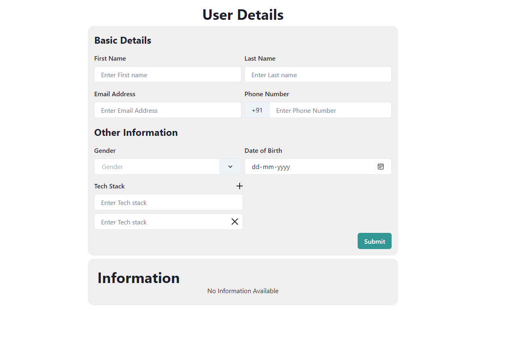

# Getting Started with User Details Site
This project is created using ReactJS, Typescript, Chakra UI, React Hook form v7.39 and Chakra React Select v3.3.1. It allows users to input their basic details, other information, and their tech stack.

Open [User Deatils Site](https://user-details.akashrp.link). Site deployed to Cloudflare pages.

## How to run the project
In the project directory, enter the following code in the terminal

### `npm start`

Runs the app in the development mode.\
Open [http://localhost:3000](http://localhost:3000) to view it in your browser.

## Features

- Input fields for first name, last name, email, phone number, gender, date of birth, and tech stack.
- Validation for all input fields.
- Dynamically adding and removing tech stack fields.
- Submission of form data to a context for further processing.

